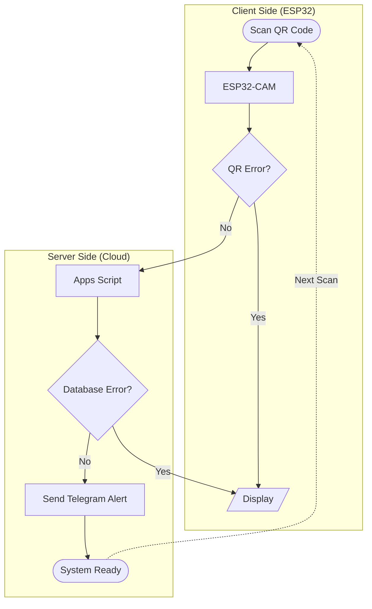

  <picture>
    <source media="(prefers-color-scheme: dark)" srcset="assets/logo/dark-logo.svg">
    <source media="(prefers-color-scheme: light)" srcset="assets/logo/logo.svg">
    
  </picture>

<h1 align="center">DesCom</h1>

DesCom (Destination Confirmation System) is an IoT-based destination monitoring system that uses **QR codes and an ESP32-CAM** to confirm when a person reaches a designated destination and notify a registered recipient through **Telegram**.

The system is specially designed for **school students**, where a student does not need a smartphone for monitoring. A **printed QR code** is sufficient to trigger the confirmation and notification process.

---

## Documentations

Read [docs](https://its-mohitkumar-7.github.io/DesCom/) for full guide and installation setups.

---

## Features

- Telegram notification alerts

- Status using LCD display

- QR code scanning using ESP32-CAM

- Person verification and scan status tracking

- Google Apps Script backend

- No smartphone required for the person being monitored

---

## System Overview

---

## Hardware

| Component                          | Purpose                              |
|:---------------------------------- | ------------------------------------ |
| ESP32-Cam with camera module       | QR scanning and Wi-Fi connection     |
| USB-to-Serial Programmer or CAM-MB | Programming and serial communication |
| 16x2 I2C LCD                       | System status display                |
| 12V 2A Adaptor                     | Power Source                         |
| Printed QR code                    | Identification                       |

---

## Software & Libraries

#### ESP32

- Arduino IDE

- ESP32 Arduino Core

- ESP32QRCodeReader

- Wifi

- HTTPClient

- Wire

- LiquidCrystal_I2C

#### Backend

- Google Apps Script

- Google Sheets

#### Notification

Telegram Bot API

---

## Credits

- QR code scanning — [ESP32QRCodeReader](https://github.com/alvarowolfx/ESP32QRCodeReader)

- Notifications — [Telegram](https://web.telegram.org/)

- Backend — [Google Apps Script](https://developers.google.com/apps-script)

---

## License

This project is under the PolyForm Noncommercial License 1.0.0 - see the [LICENSE](LICENSE) for details.

---

## Author

Developed by [its-mohitkumar-7](https://github.com/its-mohitkumar-7/)
